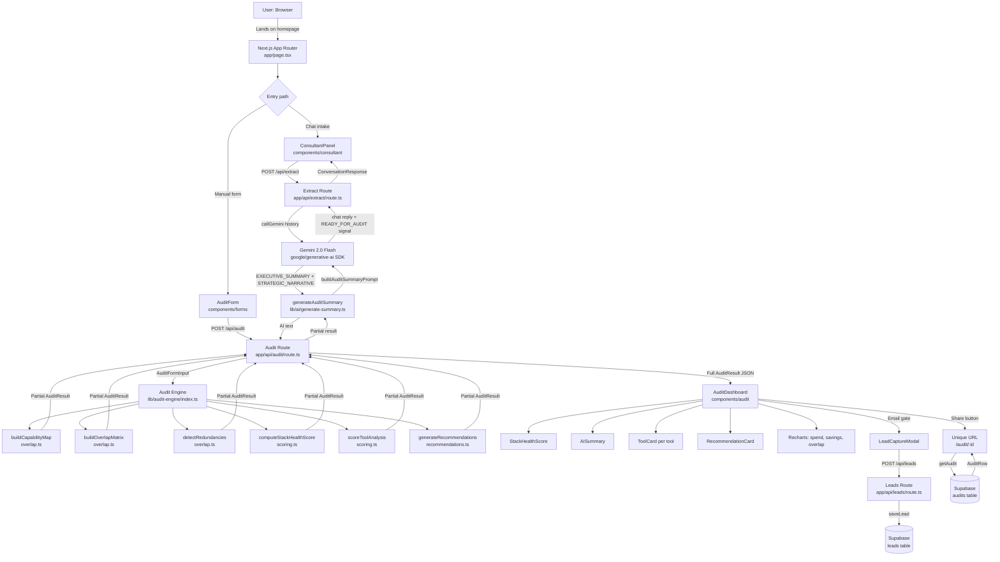

# ARCHITECTURE.md — Optivex AI

## System Diagram

---

## Data Flow: User Input → Audit Result

**1. Input collection**

The user enters their AI stack via one of two paths: the `ConsultantPanel` (chat-based, guided by Gemini) or the `AuditForm` (structured multi-step form). Both produce the same output: an `AuditFormInput` object containing team context, tool subscriptions (name, tier, seats, monthly spend, usage level), and budget.

**2. Audit engine (deterministic, no AI)**

`POST /api/audit` receives the `AuditFormInput` and passes it to `runAuditEngine()`. This runs five pure-function stages in sequence:

- `buildCapabilityMap()` — maps each tool to a set of capabilities (code-generation, writing, chat, etc.) using the `KNOWN_TOOLS` registry, with heuristic fallback for unrecognised tools
- `buildOverlapMatrix()` — computes pairwise overlap scores between all tools using Jaccard similarity on their capability sets
- `detectRedundancies()` — flags full overlaps (>75% score → critical), partial overlaps (40–74% → high), underutilisation (rarely/occasional usage), and team-size mismatches
- `computeStackHealthScore()` — produces a 0–100 composite score weighted: efficiency 35%, redundancy penalty 40%, coverage 25%
- `generateRecommendations()` — converts redundancies into prioritised, actionable recommendations sorted by severity then savings

All math is deterministic TypeScript. No LLM is involved in the audit logic — financial recommendations must be consistent and auditable.

**3. AI narrative layer**

After the engine runs, `generateAuditSummary()` calls Gemini with the full audit numbers injected into a structured prompt. Gemini returns two labelled sections: `EXECUTIVE_SUMMARY` (2–3 sentences) and `STRATEGIC_NARRATIVE` (3–4 paragraphs). If this call fails for any reason (rate limit, network, bad key), the route catches the error and falls back to a templated string built from the audit numbers — the user never sees an error.

**4. Storage and sharing**

The complete `AuditResult` is returned to the client and rendered in `AuditDashboard`. Each result has a nanoid-generated unique ID. The shareable URL (`/audit/:id`) is a Next.js dynamic route that reads the result from Supabase at request time and renders the same dashboard — with identifying details (email, company name) stripped from the public view.

Lead capture (email + optional name/company) fires after the user sees their results, stored in the Supabase `leads` table via `POST /api/leads`.

---

## Stack Choices and Justification

**Next.js 16 (App Router)**
App Router gives server components, API routes, and dynamic routing in a single framework. The audit page at `/audit/:id` is a server component that fetches from Supabase at request time — no client-side data fetching needed, better SEO, and the Open Graph tags are rendered server-side so link previews work correctly on Twitter/Slack/LinkedIn.

**TypeScript (strict mode)**
The audit engine is the core of the product — a finance person has to trust the numbers. Strict TypeScript catches shape mismatches at compile time (e.g. if `AuditFormInput` changes, every downstream consumer errors immediately). Using plain JavaScript here would have introduced subtle bugs in the scoring logic.

**Gemini 2.0 Flash over Anthropic API**
The assignment preferred the Anthropic API. Gemini was chosen because its free tier (15 RPM, 1M tokens/day) requires no credit card and no approval — anyone cloning the repo can run the full product immediately with a free API key from Google AI Studio. The `callGemini()` function is abstracted behind a single interface; swapping to Claude requires changing one line in the model config.

**Supabase over Upstash/Vercel KV**
Supabase gives a full relational database, a browser dashboard for inspecting leads, and row-level security — all on the free tier. For a lead-generation tool where Credex needs to query and export leads, a proper SQL database is the right choice over a key-value store.

**shadcn/ui + Tailwind over a component library**
shadcn/ui components are unstyled primitives that we own — no fighting against a pre-baked design system. Combined with a custom CSS variable design system (`--ox-surface`, `--ox-surface-2`, gradient tokens), the entire visual language is controlled. A library like MUI or Chakra would have required constant overriding.

**Recharts for data visualisation**
Lightweight, React-native, and composable. The three chart types (spend breakdown pie, savings comparison bar, overlap matrix) are all built from Recharts primitives with custom styling. D3 would have been over-engineered for this use case.

---

## What Would Change at 10,000 Audits/Day

At current scale (Vercel serverless + Supabase free tier), the architecture handles low-to-moderate traffic well. At 10k audits/day (~7 audits/minute sustained), several things would need to change:

**Gemini rate limits become the bottleneck.** The free tier is 15 RPM. At 7 audits/minute each triggering a Gemini call, we'd hit limits immediately. Solution: move to a paid Gemini tier, or implement a queue (Upstash QStash or BullMQ on a small server) that processes AI summary generation async and notifies the client when ready via a polling endpoint or WebSocket.

**Supabase connection pooling.** Vercel serverless functions open a new DB connection per invocation. At 10k audits/day, connection exhaustion becomes a real risk. Solution: add PgBouncer (Supabase has this built in on paid plans) or migrate to a connection-pooled setup.

**Result caching.** Many users will audit identical stacks (same tools, same tiers). The audit engine is deterministic — the same input always produces the same output. A Redis cache (Upstash) keyed on a hash of `AuditFormInput` would serve repeated audits instantly without hitting the engine or Gemini.

**CDN for the shareable audit pages.** `/audit/:id` is currently server-rendered on every request. At scale, these pages should be statically generated after creation (ISR or on-demand revalidation) and served from Vercel's edge CDN — reducing latency globally and eliminating server load for shared audit views.
